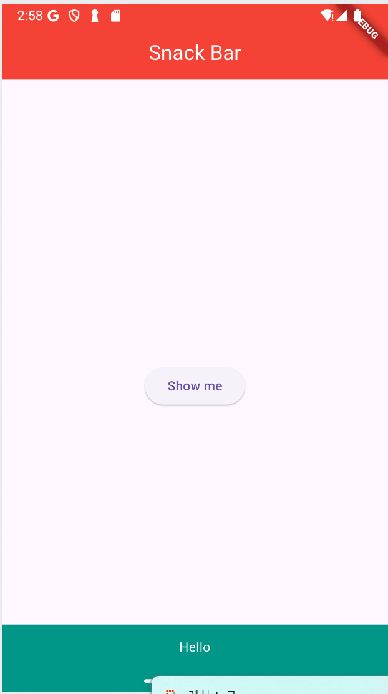
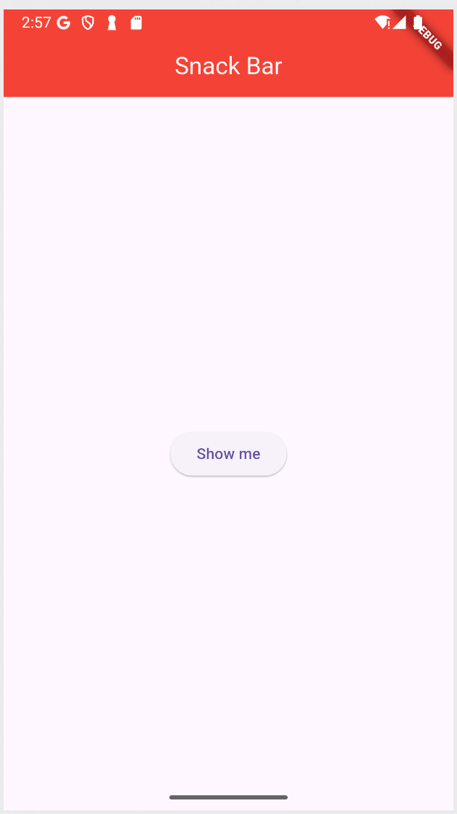

# 📘 19강 - SnackBar 예제

## ✅ 기능 요약
- 버튼을 누르면 화면 하단에 `SnackBar`가 표시됨
- `ScaffoldMessenger.of(context).showSnackBar(...)` 사용
- 텍스트는 가운데 정렬되고, 스낵바 배경색은 `teal`
- 1초 동안 표시되도록 `duration` 설정

---

## 🖼️ 결과 UI
> 캡처 이미지 직접 추가할 것:

```md



