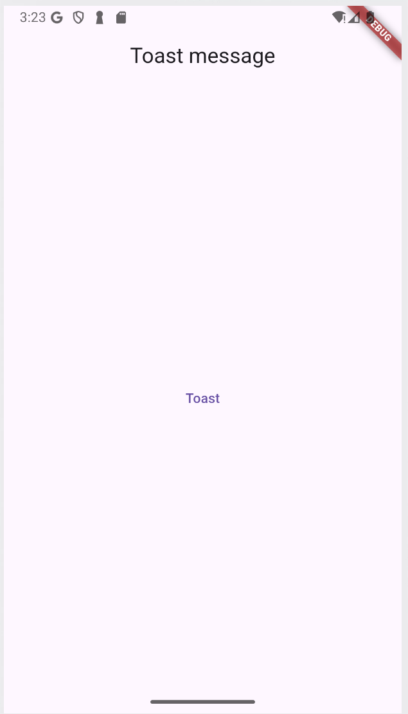
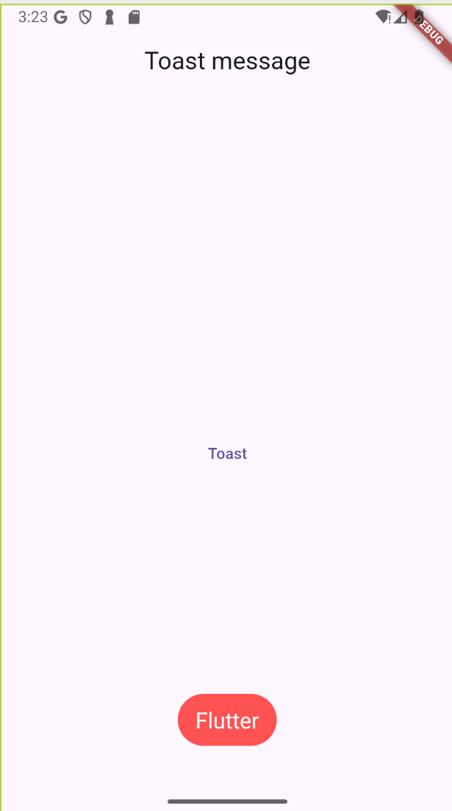

# 📱 Flutter Toast 예제

## ✅ 기능 요약
- 버튼을 누르면 화면 하단에 **Toast 메시지**가 잠깐 표시됨
- `fluttertoast` 외부 라이브러리를 사용
- 메시지 텍스트, 색상, 위치, 크기 등을 커스터마이징 가능

---

## 🖼️ 결과 UI

### 🔹 Toast 메시지 출력 화면

 
 


---

## 🧑‍💻 주요 코드

### ✨ Toast 함수 정의

```dart
void flutterToast() {
  Fluttertoast.showToast(
    msg: "Flutter",
    gravity: ToastGravity.BOTTOM,
    backgroundColor: Colors.redAccent,
    textColor: Colors.white,
    fontSize: 20.0,
    toastLength: Toast.LENGTH_SHORT,
  );
}
