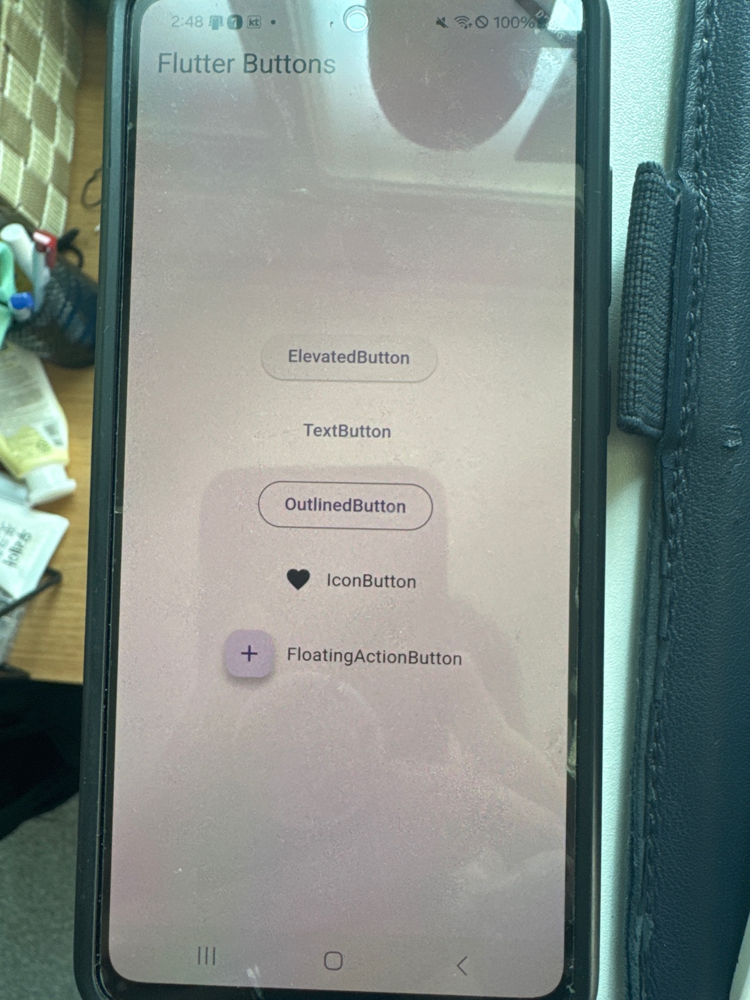

# Flutter 버튼 종류 데모

이 폴더는 다양한 종류의 버튼 사용법을 보여주는 예제입니다.

포함된 버튼 종류:

- `ElevatedButton` (RaisedButton 대체)
- `TextButton` (FlatButton 대체)
- `OutlinedButton` (OutlineButton 대체)
- `IconButton`
- `FloatingActionButton`

## 📱 스크린샷

